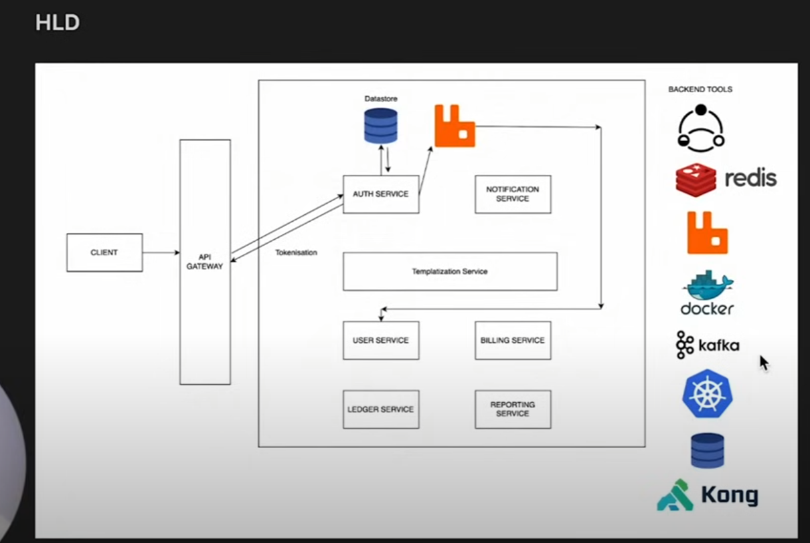

# 💰 Expense Tracker App

A modern, scalable expense tracking application built with microservices architecture for seamless financial management.

## ✅ **Functional Requirements**

### Core Features
- **User Authentication**: Login aur Sign Up functionality
- **Manual Expense Management**: Expenses manually add/remove kar sakte hai
- **Expense Visualization**: Expenses ko categories ke saath dekh sakte hai
- **Analytics & Reports**: Weekly, monthly, yearly reports aur spending statistics

## ✅ **Non-Functional Requirements**

### Performance & Reliability
- **Fault Tolerant**: System fail ho jaye to bhi handle kare gracefully
- **Scalable**: Jyada users aaye to efficiently handle kare
- **Low Latency**: Response time < 100ms
- **Config-Driven**: Future updates ke liye kam code changes karne pade

## 🚀 **Future Scope Requirements**

### Advanced Features
- **Financial Behavior Tracking**: AI-powered spending analysis with improvement tips
- **Auto Expense Detection**: SMS parse karke automatically expenses add kare (user permission ke saath)
- **Smart Notifications**: WhatsApp aur SMS alerts for:
  - Risk indicators
  - Overspending warnings
  - Budget recommendations

## 🏗️ **HLD (High-Level Design) Architecture**



### System Architecture Flow
```
CLIENT 
   ↓
API GATEWAY (Kong)
   ↓ (Tokenization)
AUTH SERVICE ←→ Datastore
   ↓
RabbitMQ (Message Queue)
   ↓
Templatization Service ←→ NOTIFICATION SERVICE
   ↓
┌─────────────┬─────────────┬─────────────┐
│ USER        │ BILLING     │ REPORTING   │
│ SERVICE     │ SERVICE     │ SERVICE     │
└─────────────┴─────────────┴─────────────┘
   ↓
LEDGER SERVICE
```

## 🔧 **Tech Stack Implementation**

### 1. **Client Request Flow**
- **Client** request karega
- **Kong API Gateway** me wo request route ho jayegi
- **Auth Service** ke liye tokenization hoga
- **Client me token store** ho jayega
- **Datastore me** bhi store karega
- **Queue me** message publish hoga

### 2. **API Gateway - Kong**
- **Entry Point**: Sabse pehle yaha aayegi har request
- **HTTP Requests**: Circuit breaker ke through jayega
- **Circuit Breaker**: Resilience4j use karenge
- **Features**: 
  - Route management
  - Load balancing
  - Rate limiting

### 3. **Authentication Process**
- User login/signup kar raha hai
- Agar user ka info nahi hai to queue me publish ho jayega
- Queue **RabbitMQ** se handle hoga
- Token generate hoke client me store ho jayega

### 4. **Caching Strategy**
- **Redis** use karenge cache ke liye
- **Short time** ke liye instance save karenge
- Frequently accessed data fast retrieve hoga

### 5. **Message Queue Management**
- **RabbitMQ**: Primary message broker
- **Kafka**: Jab 5-6 queue ho jaye to usko manage karne ke liye
- Multiple queue instances efficiently handle karenge

### 6. **Microservices Detail**

#### **Auth Service**
- Token generation aur validation
- Datastore ke saath connected
- JWT/OAuth implementation

#### **User Service**
- User login/signup handle karta hai
- User ka info store hota hai queue me
- Profile management

#### **Notification Service**
- Templatization Service ke saath connected
- SMS aur WhatsApp integration
- Risk aur overspending alerts

#### **Billing Service**
- Expense calculations
- Financial data processing
- Payment related operations

#### **Reporting Service**
- Weekly/monthly/yearly reports
- Analytics aur statistics
- Data visualization

#### **Ledger Service**
- Core financial transactions
- Main accounting ledger
- Audit trails

### 7. **Resilience Pattern**
- **Circuit Breaker**: Resilience4j library use karenge
- Service down ho jaye to fail-fast mechanism
- Automatic recovery aur fallback responses

### 8. **Backend Tools Used**

#### **Docker** 🐳
- **Purpose**: Sabko containerize karenge
- Poora microservice bana lenge to deployment ke liye Docker container use karenge
- Local system me container deploy karenge

#### **Kubernetes** ⚓
- **Local Deployment**: Pehle locally deploy karenge
- **Why Local?**: Pata chale locally kaise ho raha hai
- Cloud me jana hai lekin usse pata nahi chalega kaam kaise ho raha
- Phir cloud service pe deploy karenge

#### **Redis** ❤️
- Cache ke liye use karenge
- Fast data retrieval
- Session management

#### **Kafka** 🔗
- Multiple queues handle karne ke liye
- High throughput scenarios
- Event streaming

#### **Kong API Gateway** 🦍
- Entry point for all requests
- Load balancing aur routing
- Security layer

#### **Database** 💾
- SQL/NoSQL depends on implementation
- Transactional data storage
- User aur expense data

### 9. **Deployment Strategy**

#### **Phase 1: Local Testing**
```
Docker Containers → Kubernetes (Local) → Testing
```
**Kyun Local Pehle?**
- Locally samajh aaye kaise services interact kar rahi
- Debug easily ho jaye
- Container behavior validate kar sake

#### **Phase 2: Cloud Deployment**
```
Local Success → Cloud Platform → Production
```

### 10. **Data Flow (Step by Step)**

1. **Client** request bhejta hai
2. **Kong** receive karke route karta hai  
3. **Auth Service** tokenization karta hai
4. **Redis** me cache check karta hai
5. **RabbitMQ** me message publish hota hai
6. **Microservices** async process karte hai
7. **Database** operations hote hai
8. **Response** wapis client ko jata hai

### 11. **Notification Flow**
- **Templatization Service** templates banati hai
- **Notification Service** SMS/WhatsApp bhejti hai
- **Triggers**: Risk detection, overspending alerts

## 🔒 **Security Features**
- JWT token-based authentication
- API rate limiting through Kong
- Encrypted data storage
- Secure message queuing

## 📈 **Scalability Approach**
- **Horizontal Scaling**: Kubernetes se multiple instances
- **Async Processing**: Message queues se load distribute
- **Caching**: Redis se fast access
- **Independent Services**: Har service alag se scale ho sakti

## 🛠️ **Development Process**
1. Individual microservices develop karo
2. Docker se containerize karo
3. Local me Kubernetes se test karo
4. Message queues integrate karo
5. Circuit breakers add karo
6. Redis caching implement karo
7. Cloud pe final deployment karo

---

**Bottom Line**: Ye architecture modern microservices best practices follow karta hai aur scalable, fault-tolerant expense tracker banata hai!
